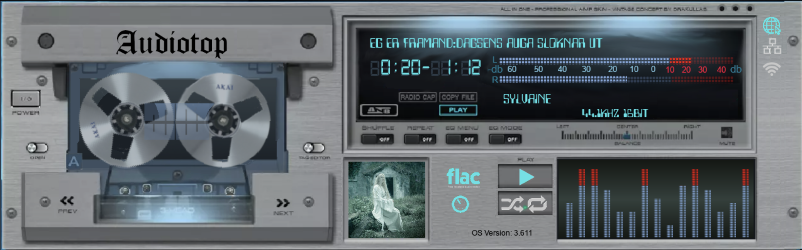
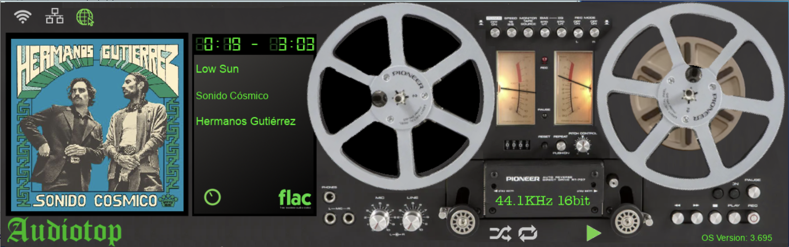
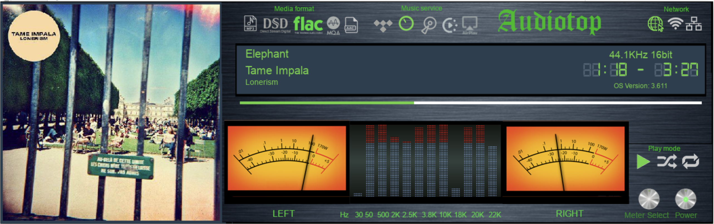
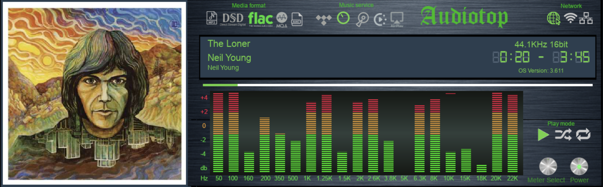
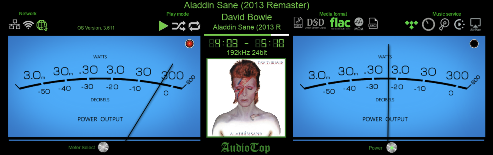

# General
* Audiotop is a volumio plugin which integrates volumio and peppymeter
 * The project code is based on peppymeter and peppyspectrum ("Picasso Edition" 2024.02.10) 
   * https://github.com/project-owner/PeppyMeter
   * https://github.com/project-owner/PeppySpectrum
 * Using the peppyalsa driver
   * https://github.com/project-owner/peppyalsa
 * Runs on volumio os (base version 3.631)
   * https://volumio.com/get-started/
 * With raspberry pi 5
 * Display - waveshare hdmi 7.9" 1280*400
 * Linear Power supply 5V 3.5A
 * 2TB SSD 

# version 1.0.3
## 29.5.2024
* Edit some steps in the installation process
* Add AKAI Deck skin

# version 1.0.2
## 18.5.2024
* Fix some typo mistakes in this document

# version 1.0.1
## 15.5.2024
* Add NAD Deck skin

* Add Pioneer 707 skin

# version 1.0.0
## 1.5.2024
* Significant performance improvements for CPU usage
* Bugs fix
* Add Marantz skin

* CPU and MEM usage with the marantz meter

# version 0.0.3
## 28.4.2024
* Add DSD support for meter animations

# version 0.0.2
## 17.4.2024
* Add peppy spectrum analyzer support
  * Integrate peppy spectrum with peppy meter by replacing all the threads that are used in spectrum with the meter event loop  
  * "metaspectrum" new meter with meter and spectrum 

  * "metabarspectrum" new meter with spectrum
  
* Add some settings to the volumio plugin to configue the meters switching method

 

# version 0.0.1
## 3.3.2024
* 3 types of meters using the volumio titles metadata 
  * With this version, only support the 1280*400 resolution
  * Custom skins can be added (for all resultion) 
    * Look at the meters.txt file
  * "matablue" Blue 2Ch Circular
 
  * "metabar" 2Ch with linear bars
 
  * "metapioneercassete" 2Ch vertical linear  bars with  cassete animation
 

# Featuers
* Touch button to switch  between meters
* Touch button to power off the meter and go to the volumio web page
* Restore alsa conf file (asound.conf) in order to make os version update from volumio ui.
  * Instead , do the update with forceupdate option using ssh
   $ volumio updater forceupdate volumio
* Switching meters from the volumio app UI from the plugin area 
* Network indicators for wifi,lan,internet

# Notes

* Remote Music services tested and working with meter :
  * Tidal connect
  * Airplay
* Theoretically supports everything that works with the original volumio official os version

#  Installation
## Install volumio
* Install the lateset version of Volumio
* Browse to http://volumio.local/dev and enable ssh
## Install peppyalsa
* ssh volumio@volumio.local 

    (password:volumio)

* sudo apt update
* git clone https://github.com/project-owner/peppyalsa.git
* sudo apt-get install build-essential autoconf automake libtool libasound2-dev libfftw3-dev
* cd peppyalsa
* aclocal && libtoolize
* autoconf && automake --add-missing
* ./configure && make
* sudo make install
* mkfifo /home/volumio/myfifo
* chmod 777 /home/volumio/myfifo
* mkfifo /home/volumio/myfifosa
* chmod 777 /home/volumio/myfifosa
## Install Audiotop plugin
* cd /home/volumio
* git clone  --branch spectrum https://github.com/ofirasp/AudioTop.git
* cd Audiotop
* volumio plugin install
*
 (Note:Don't enable the Autiotop plugin yet)
*

* sudo mv /volumio/app/plugins/audio_interface/alsa_controller/index.js /volumio/app/plugins/audio_interface/alsa_controller/index.js.original.js
* sudo cp /home/volumio/AudioTop/volumiomod/index.js.audiotop.js /volumio/app/plugins/audio_interface/alsa_controller/index.js
* sudo mv /volumio/app/plugins/music_service/mpd/mpd.conf.tmpl /volumio/app/plugins/music_service/mpd/mpd.conf.tmpl.original
* sudo cp /home/volumio/AudioTop/volumiomod/mpd.conf.tmpl.audiotop.tmpl /volumio/app/plugins/music_service/mpd/mpd.conf.tmpl

* cd /data/plugins/user_interface/audiotop
* python3 -m pip install -r requirements.txt
* sudo tar -xzf depends/PIL.tar.gz  -C /usr/local/lib/python3.7/dist-packages

## Install Touch Display plugin

* Install from the volumio UI available plugins
* Enable the touch display plugin
* Go to its settings and Set the orientation to 270
## Fix orientation for waveshare 1280X400 display

* mkdir /home/volumio/.config/openbox

* cat >> /home/volumio/.config/openbox/autostart <<EOL

xrandr --output HDMI-1 --rotate left

EOL

* sudo reboot

* in case you don't see anything on the display after reboot, do the following:

* nano /boot/userconfig.txt
* add the following text
  * hdmi_group=2
  * hdmi_mode=87
  * hdmi_timings=400 0 100 10 140 1280 10 20 20 2 0 0 0 60 0 43000000 3
* Save and exit nano

* sudo reboot

* if no display go to see more info in :https://www.waveshare.com/wiki/7.9inch_HDMI_LCD

## Install dummy audio device for DSD meter
* sudo nano /etc/rc.local 
* before the line exit 0 add:
  * /sbin/modprobe snd-dummy index=7 pcm_substreams=1 fake_buffer=0 
* save and exit 
* enable the audiotop plugin
* reboot

